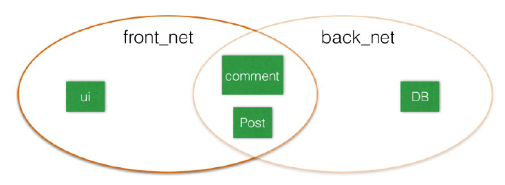

# Dockerfile

[Install VirtualBox](https://phoenixnap.com/kb/install-virtualbox-on-ubuntu)

```
sudo apt-get update
sudo apt-get install virtualbox
```

[This computer doesn't have VT-X/AMD-v enabled. Enabling it in the BIOS is mandatory](https://github.com/docker/machine/issues/4271)

* FIX: VM-->Settings--->Processor-->Enable "Virtualize Intel VT-x/EPT "...

## Docker machine

```
docker-machine create --driver=virtualbox default
```

- Check that Docker-host succesfully created

```
docker-machine ls
```

- For export variables into current shell use

```
eval $(docker-machine env)
```

## Repo structure

- [Dockerfile](Dockerfile) - description of the image
- [mongod.conf](mongod.conf) - config prepared in advance for mongodb
- [db_config](db_config) - contains variable with link to mongodb
- [start.sh](start.sh) - script for application execution

## Image build

- Now we are ready to build our image
  - Execute command
    - Dot in the end is must, it points to the path to the Docker-context
    - Flag -t defines tag for the built image
  
```
docker build -t app:latest .
```

- Check the result

```
docker images -a
```

## Start a container

- Pefect, now it is possible to run our container with command

```
docker run --name app -d --network=host app:latest
```

- Check the result

```
docker-machine ls
```

* Open a link in the browser
http://192.168.99.100:9292

## Docker hub

- Download our image into docker hub for using in the future

```
docker tag app:latest <your_dockerhub_account>/app:1.0
```

[See example](https://hub.docker.com/repository/docker/rhinock/app/general)

# Docker Compose

- [7.11 Git Tools - Submodules](https://git-scm.com/book/en/v2/Git-Tools-Submodules)
- [remove git submodule but keep files](https://stackoverflow.com/a/26752628/16420746)

# Docker Practice 3

## Networking in Docker

- none
- host
- bridge

### None network driver

- Let's start the container using the none-driver.
- We use joffotron/docker-net-tools as an image.
- We do this to save time and effort. 
  - It already includes the necessary utilities for working with the network: 
    - the bind-tools;
    - net-tools;
    - and curl packages.
- The container will start a sleep process with a timer for 100 seconds.
- After 100 seconds have elapsed, the container will be stopped and removed (--rm flag).

Let's run:
```
docker run --network none --rm -d --name net_test joffotron/docker-net-tools -c "sleep 100"
```

Then:
```
docker exec -ti net_test ifconfig
```

As a result, we see:
- that only loopback exists inside the container from network interfaces.
- the network stack of the container itself works (ping localhost), but without the ability to contact the outside world.
- This means that you can even run network services inside such a container, but only for local experiments 
  - testing;
  - containers for performing one-time tasks;
  - etc.

### Host network driver

Let's start the container in the network space of the docker host:
```
docker run --network host --rm -d --name net_test joffotron/docker-net-tools -c "sleep 100"
```

Compare the output of the commands:
```
docker exec -ti net_test ifconfig
```

And
```
ifconfig
```

Run several times (2-4):
```
docker run --network host -d nginx
```

What is the result?

<details>
  <summary>Answer</summary>
  --network="bridge" : Connect a container to a network
  <li>'bridge': create a network stack on the default Docker bridge</li>
  <li>'none': no networking</li>
  <li>'container:<name|id>': reuse another container's network stack</li>
  <li><b>'host': use the Docker host network stack</b></li>
  <li>'&lt;network-name&gt;|&lt;network-id&gt;': connect to a user-defined network</li>
</details>

What did the next command give?
```
docker ps
```

<details>
  <summary>Answer</summary>
  <li>List containers</li>
  <li>In this case it will return only the last created container with status 'Up'</li>
  <li>Previous created containers will be shown with status 'Exited'</li>
</details>

Why do you think?

<details>
  <summary>Answer</summary>
  <li>Only last version of the container is relevant</li>
</details>

Stop all running containers:
```
docker kill $(docker ps -q)
```

### Docker networks

On the docker-host machine, run the command:
```
sudo ln -s /var/run/docker/netns /var/run/netns
```

You can now view the currently existing net-namespaces with the command:
```
sudo ip netns
```

Task: Re-launch containers using the none and host drivers and see how the list of namespaces changes.

Command below will allow to execute commands in the selected namespace:
```
sudo ip netns exec <namespace> <command>
```

Example:
```
sudo ip netns exec 195847b8dda1 ls
```

### Microservice app

This practice uses the microservice version of the application from Docker Practice 2.

Download the repository from the microservices branch:
```
git clone -b microservices https://github.com/yagubern/app.git
```

Let's collect images for each service:
```
export USER_NAME=<your_login>
cd app/comment
chmod u+x ./docker_build.sh
bash docker_build.sh
cd ../post-py
chmod u+x ./docker_build.sh
bash docker_build.sh
cd ../ui
chmod u+x ./docker_build.sh
bash docker_build.sh
```

### Bridge network driver

Create a bridge network in docker (the --driver flag is optional, because the default is bridge):
```
docker network create app --driver bridge
```

Let's run our app project using a bridge network:
```
docker run -d --network=app mongo:3.2
docker run -d --network=app <your-login>/post:latest
docker run -d --network=app <your-login>/comment:latest
docker run -d --network=app -p 127.0.0.1:9292:9292 <your-login>/ui:latest
```

Let's go to the address http://127.0.0.1:9292


In fact, our services refer to each other by dns names written in the code. 

In the current installation, the built-in DNS docker does not know anything about these names.

The solution to the problem is to assign names or network aliases to containers at startup:
```
--name <name> (only 1 name can be specified)
--network-alias <alias-name> (multiple aliases can be specified)
```

Stop old copies of containers:
```
docker kill $(docker ps -q)
```

Let's launch new:
```
docker run -d --network=app --network-alias=post_db --network-alias=comment_db mongo:3.2
docker run -d --network=app --network-alias=post <your-login>/post:latest
docker run -d --network=app --network-alias=comment <your-login>/comment:latest
docker run -d --network=app -p 127.0.0.1:9292:9292 <your-login>/ui:latest
```

### Docker-compose

- One application consists of many containers / services
- One container depends on the other
- Startup order matters
- docker build / run / create ... (long and long)
- Standalone utility
- Declarative description of the docker infrastructure in YAML format
- Management of multi-container applications
- Syntax reference: https://docs.docker.com/compose/compose-file/

#### Plan

- Build app images using docker-compose
- Run app with docker-compose

#### docker-compose.yml

- Create a [docker-compose.yml](docker-compose.yml) file in the project directory.
- It is important that the ui, comment, post folders are next to each other.

Note that docker-compose supports
- Interpolation (substitution) of environment variables.
  - In this case, it is the USERNAME variable.
- Therefore, before starting, it is necessary to export the values of these environment variables.

Run:
```
export USERNAME=<your-login>
docker-compose up -d
docker-compose ps
```

You should see a similar picture in the output:


Go to http://127.0.0.1:9292/
and make sure the project is working correctly

#### Homework #1

Add [docker-compose.yml](docker-compose.yml) so that microservices are launched in 2 bridges as follows:



That is, so that the ui service does not have access to the database.

#### Homework #2

Parameterize with environment variables:
- port of publication of the ui service
- service versions
- maybe something else at your discretion

Write the parameterized parameters to a separate file with the .env extension
- [Environment variables in Compose](https://docs.docker.com/compose/environment-variables/)

Without using the source and export commands, docker-compose must pick up the variables from this file.

# Kubernetes

[kubectl Cheat Sheet](https://kubernetes.io/docs/reference/kubectl/cheatsheet/)

## hosts file
```sh
# <minikube ip> app.com
192.168.49.2 app.com
```

## Apply manifests
```sh
k apply -f k8s/
```

## Remove Kubernetes generated items
```sh
k delete -f k8s/
k delete pvc mongo-volume-mongo-statefulset-0
```

## Get Kubernetes generated items
```sh
k get sc
k get pv
k get pvc
k get sts
k get deploy
k get rs
k get svc
k get ingress
k get endpoints
k get po
```